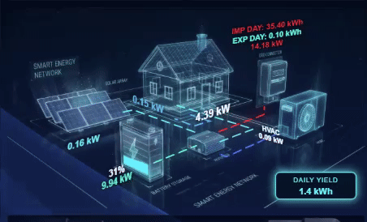

# Hassio Energy Card (Custom Lumina)

A highly customized configuration for the Home Assistant Energy Dashboard, based on the [Lumina Energy Card](https://github.com/ratava/lumina-energy-card).

This repository contains a specialized setup featuring a **Neon/Cyberpunk** aesthetic, transparency support, and re-purposed entity slots for advanced home monitoring (HVAC, Offices).

## 🎥 Preview



## ⚡ Features

- **Neon/Cyberpunk Theme:** Custom color palette optimized for dark/AMOLED dashboards (Cyan `#00f2ff`, Deep Blue `#0080ff`).
- **Advanced Monitoring:**
  - **PV:** Production, Strings, Remaining forecast.
  - **HVAC & Office:** Re-purposed generic 'Car' slots to monitor Heat Pumps and Office consumption.
  - **Grid:** Import/Export visualization.
- **Interactive Popups:** Detailed data on click (Tomorrow's forecast, Battery cycles, Inverter temps).
- **Transparency:** Fully transparent backgrounds for seamless integration with dashboard wallpapers.

## 🖼️ Included Assets

This repository includes custom generated backgrounds located in the `images/` directory, optimized for this configuration:

| File | Description |
|------|-------------|
| `lumina_background-hvac.png` | Standard background with HVAC visualization |
| `lumina_background-hvac-transparent.png` | Transparent version for overlay use (Recommended) |
| `lumina_background-car.png` | Alternative background with Car visualization |

## 🛠️ Installation

1. Ensure you have the `lumina-energy-card` installed (via HACS or manual).
2. Copy the contents of the `images/` folder to your Home Assistant `/local/images/` directory (or adjust paths in the config).
3. Use the configuration below in your Lovelace dashboard.

## ⚙️ Configuration

### Entity Mapping logic
This configuration repurposes standard slots for specific use cases:
| Standard Slot | Mapped To | Description |
|--------------|-----------|-------------|
| `car1` | **HVAC** | Heat Pump / Climate control consumption |
| `car2` | **BIURA** | Office equipment consumption |

### YAML Code
```yaml
type: custom:lumina-energy-card
language: en
# Visuals & Assets
background_image: /local/images/lumina_energy_transparent.png
background_image_heat_pump: /local/images/lumina_background-hvac-transparent.png
header_font_size: "22"
animation_speed_factor: 0.5
animation_style: dashes

# --- COLOR PALETTE (Neon/Cyberpunk) ---
# Photovoltaics
pv_primary_color: "#00f2ff"
pv_tot_color: "#00f2ff"
pv_secondary_color: "#0080ff"
pv_string1_color: "#00c3ff"
pv_string2_color: "#00c3ff"
pv_string3_color: "#00c3ff"
pv_string4_color: "#00c3ff"
pv_string5_color: "#00c3ff"
pv_string6_color: "#00c3ff"

# Load & House
load_flow_color: "#00f2ff"
load_text_color: "#ffffff"
house_total_color: "#00f2ff"
load_threshold_warning: 10
load_warning_color: "#ff9900"
load_threshold_critical: 15
load_critical_color: "#ff3333"

# Inverter & Battery
inv1_color: "#0080ff"
inv2_color: "#0080ff"
battery_soc_color: "#ffffff"
battery_charge_color: "#00ffcc"
battery_discharge_color: "#ffffff"
battery_fill_high_color: "#00f2ff"
battery_fill_low_color: "#ff3333"
battery_fill_low_threshold: 20

# Grid
grid_import_color: "#ff3333"
grid_export_color: "#00ffcc"
grid_warning_color: "#ff9900"
grid_critical_color: "#ff3333"

# Custom Loads (HVAC/Office)
car_flow_color: "#0080ff"
car1_color: "#ffffff"
car2_color: "#ffffff"
car1_name_color: "#e0ffff"
car2_name_color: "#e0ffff"
car2_pct_color: "#00f2ff"
heat_pump_flow_color: "#00c3ff"
heat_pump_text_color: "#00c3ff"

# --- SENSORS & DATA ---
sensor_pv_total: sensor.pv_power
sensor_daily: sensor.solar_energy_today
sensor_home_load: sensor.60eh103047hm011_loads_power
sensor_grid_import_daily: sensor.grid_consumption_energy_today
sensor_grid_export_daily: sensor.feed_in_energy_today
sensor_grid_import: sensor.60eh103047hm011_grid_consumption_power
sensor_grid_export: sensor.60eh103047hm011_feedin_power

# Battery
sensor_bat1_soc: sensor.battery_soc
sensor_bat1_power: sensor.invbatpower
invert_battery: true

# Heat Pump (Main)
sensor_heat_pump_consumption: sensor.calkowity_pobor_energii_biura # Check mapping

# Custom Consumers (Mapped as Cars)
show_car_soc: true
# HVAC
car1_label: HVAC
sensor_car_power: sensor.calkowity_pobor_energii_klimat_w_domu
# Office
car2_label: BIURA
sensor_car2_power: sensor.calkowity_pobor_energii_biura

# --- POPUPS & EXTRAS ---
# PV Details
sensor_popup_pv_1_name: "Dzisiejsza produkcja: "
sensor_popup_pv_1: sensor.energy_production_today
sensor_popup_pv_2_name: "Jutrzejsza produkcja: "
sensor_popup_pv_2: sensor.energy_production_tomorrow
sensor_popup_pv_3_name: "Pozostało produkcji dzisiaj: "
sensor_popup_pv_3: sensor.energy_production_today_remaining

# Battery Details
sensor_popup_bat_1_name: "Tryb pracy: "
sensor_popup_bat_1: select.work_mode
sensor_popup_bat_2_name: "Ładowanie baterii dzisiaj: "
sensor_popup_bat_2: sensor.battery_charge_today

# Inverter Details
sensor_popup_house_1_name: Temperatura inwertera
sensor_popup_house_1: sensor.invtemp

# UI Settings
display_unit: kW
update_interval: 30
show_grid_flow_label: false
show_daily_grid: true

# Font Sizes
daily_label_font_size: "15"
pv_font_size: "20"
battery_power_font_size: "20"
load_font_size: "22"
heat_pump_font_size: "20"
grid_font_size: "17"
sensor_popup_pv_1_font_size: "17"
sensor_popup_pv_2_font_size: "17"
sensor_popup_pv_3_font_size: "17"

